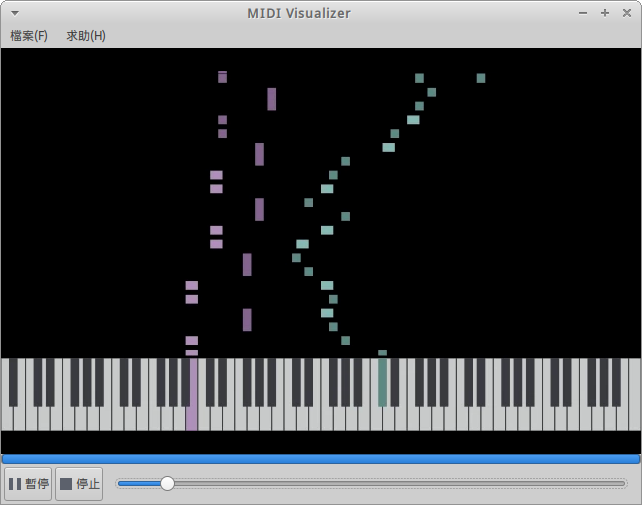
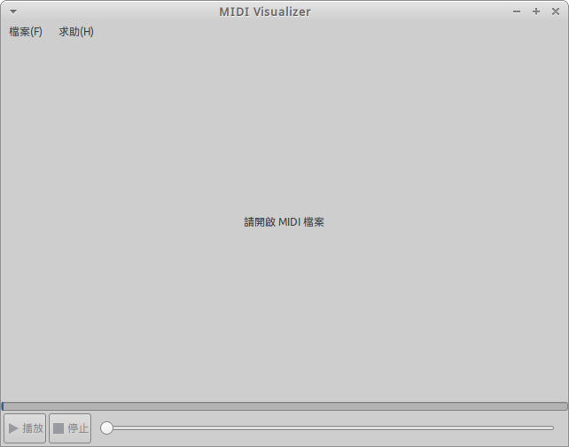
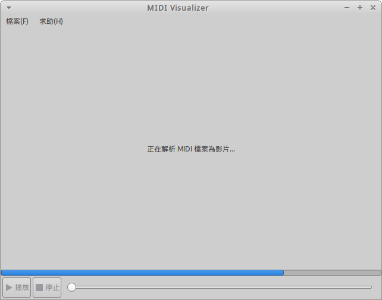
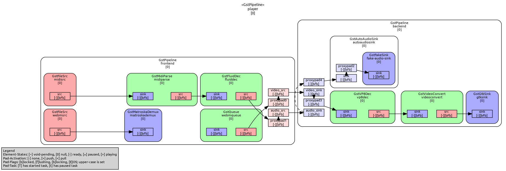

# MIDI Visualizer
MIDI visualizer is a Gtk application to visualize MIDI file as piano tutorials.



This project contains only the most basic features, and remains lots of space for performance improvement. For those who're interested, I would suggest [build a Gstreamer plugin](https://gstreamer.freedesktop.org/documentation/plugin-development/) from scratch instead of forking this repository.

This repository is homework from the course Multimedium Computing Environment (NTU, 2018 Spring).

## Build Environment

### Linux

```bash
$ sudo apt install gstreamer1.0-plugins-bad python3-pip ffmpeg libffi-dev
$ pip3 install --user gizeh moviepy mido intervaltree
```

### Windows

1. Install [Python 3.4](https://www.python.org/downloads/release/python-340/)
    - Noted thst PyGObject for Windows do not support Python 3.5 or above
2. Install [PyGObject for Windows](https://sourceforge.net/projects/pygobjectwin32/)
    1. Choose these items in GNOME libraries:
        - Base packages
        - Gst-plugins
        - Gst-plugins-extra
        - Gst-plugins-more
        - Gstreamer
        - GTK+
        - JSON-glib
    2. Choose none in non-GNOME libraries
    3. Choose none in development packages
3. Open the `cmd.exe` to prepare for installing dependencies
    ```batch
    > python -m pip install --upgrade pip
    > pip install requests pycparser
    ```
4. Download wheel packages from [Unofficial Windows Binaries for Python Extension Packages](https://www.lfd.uci.edu/~gohlke/pythonlibs)
    - `cffi‑1.11.5‑cp34‑cp34m‑win_amd64.whl`
    - `moviepy‑0.2.3.4‑py2.py3‑none‑any.whl`
5. Open the `cmd.exe` again to install dependencies
    ```batch
    > pip install cffi‑1.11.5‑cp34‑cp34m‑win_amd64.whl
    > pip install moviepy‑0.2.3.4‑py2.py3‑none‑any.whl
    > pip install gizeh mido intervaltree
    ```
6. Open `C:\Python34\Lib\site-packages\cairocffi\__init__.py`
    - Change line 41 and save
        ```diff
        - cairo = dlopen(ffi, 'cairo', 'cairo-2')
        + cairo = dlopen(ffi, 'cairo', 'cairo-2', 'cairo-gobject-2')
        ```

## Execute the Program

```bash
$ python3 main.py
```
And a Gtk window should show up.


Then you need to open a MIDI file and wait for video generating (about 1 minute for each of example midi files).


**Noted**: There are some issues with playing the video in Windows, but its saving feature still works.

## Details Explanation

### Pipeline for Playing Video


### Pipeline for Saving Video


## Contributes
1. Gtk framework
    - [Gtk+](https://www.gtk.org/): a multi-platform toolkit for creating graphical user interfaces
    - [Gstreamer](https://gstreamer.freedesktop.org/): a library for constructing graphs of media-handling components
2. Dependent packages
    - [gizeh](https://github.com/Zulko/gizeh): a Python library for vector graphics
    - [moviepy](https://github.com/Zulko/moviepy): a Python library for video editing
    - [mido](https://github.com/olemb/mido/): a library for working with MIDI messages and ports
    - [intervaltree](https://github.com/chaimleib/intervaltree): a mutable, self-balancing interval tree
3. Resources
    - `midi/The Positive And Negative.mid` is from [Chris33711's Youtube video](https://www.youtube.com/watch?v=n2HGEiUBTQY)
    - `midi/Charming Domination.mid` is from [Chris33711's Youtube video](https://www.youtube.com/watch?v=psOjoZmGLnA)
    - `soundfont/Touhou.sf2` is from [musical-artifacts.com](https://musical-artifacts.com/artifacts/433)
